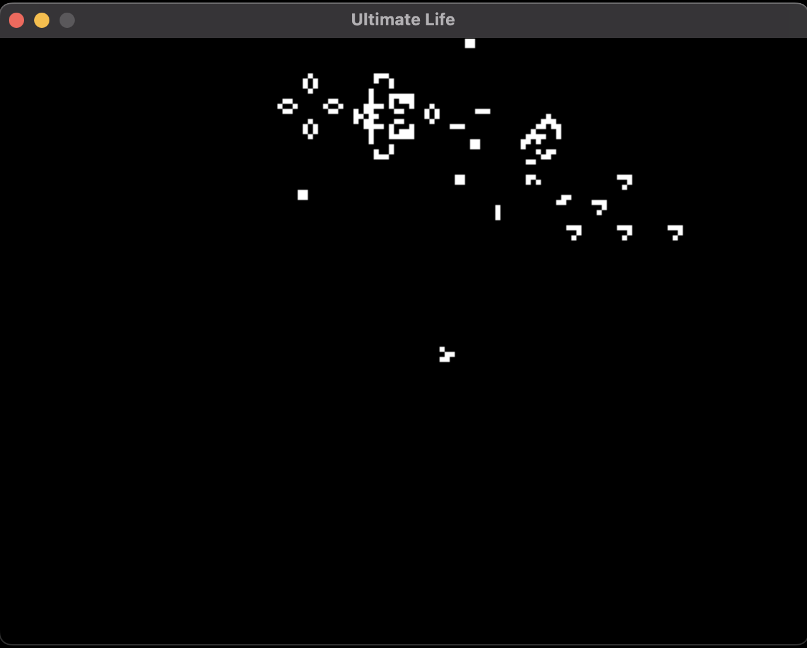

Ultimate Life
=================================================================================

Conway's Game of Life, but bigger, better, badder

Installation
---------------------------------------------------------------------------------

Right now we're only installing from source. You will need `conan` to run this.
If you have Python, simply run `pip install conan` and that should take care of
that.

Run the `gimmeit.sh` shell in a terminal. It should set up the project, install
dependencies, build, and install everything

    $ pip install conan
    $ ./gimmeit.sh

Life Script
---------------------------------------------------------------------------------

Example

    grid width 640
    grid height 480
    grid cellsize 4

    def rpentomino
        +1 +0
        +2 +0
        +1 +1
        +0 +1
        +1 +2
    end

    def blinker
        +1 +0
        +1 +1
        +1 +2
    end

    def se_glider
        -1 +0
        +0 +1
        +1 +1
        +1 +0
        +1 -1
    end

    def ne_glider
        -1 +0
        +0 -1
        +1 -1
        +1 +0
        +1 +1
    end

    def ne_glider_row
        @ne_glider +10 +10
        @ne_glider +15 +15
        @ne_glider +20 +20
        @ne_glider +25 +25
        @ne_glider +30 +30
        @ne_glider +35 +35
        @ne_glider +40 +40
        @ne_glider +45 +45
    end

    # Main life game
    @ne_glider_row 10 50
    @ne_glider_row 20 50
    @ne_glider_row 30 50
    @rpentomino 90 20